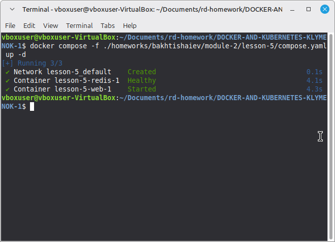

### Додавання залежностей та хелсчеків

В цілому, файл compose.yaml достатньо самопояснюючий
Додана залежність додатку від редіса за допомогою:
```
    depends_on:
      redis:
        condition: service_healthy
```

Хелсчек редіса взятий з офіціальної доки:
```
    healthcheck:
      test: ["CMD", "redis-cli", "ping"]
      interval: 3s
      timeout: 1s
      retries: 3
```
Доданий волюм sample_app для зберігання даних між сесіями.
Запуск виконаний стандартною командою:
`docker compose -f ./homeworks/bakhtishaiev/module-2/lesson-5/compose.yaml up -d`

Результат:




