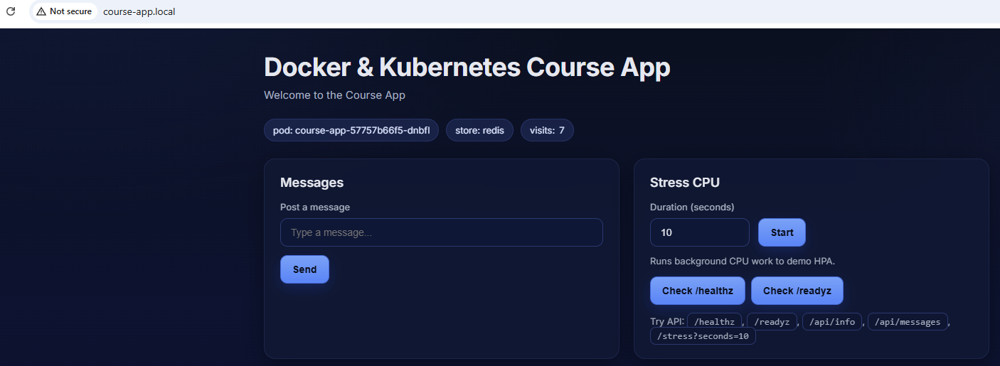
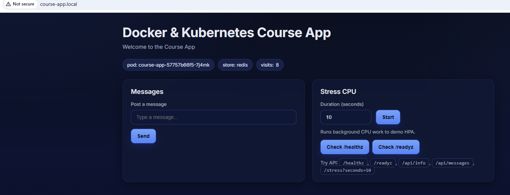

### Робота з Persistent Storage у Kubernetes

По цій роботі мало чого можна сказати. Перши три пункти по інструкції.
Четверти пункт я вже зробив, коли виконував 7 ДЗ.
Запускаємо додаток і оновлюємо сторінку кілька разів

Зупиняємо все:
```
Arsen@DESKTOP-G8LOPU1 MINGW64 /d/Dev projects/DOCKER-AND-KUBERNETES-KLYMENOK/homeworks/bakhtishaiev/module-3/lesson-10 (bakhtishaiev_a_hw_module3_lesson10)
$ kubectl delete --all deployments --namespace=default
deployment.apps "course-app" deleted from default namespace
```
і запускаємо наново.
Перевіряємо лічильник:
