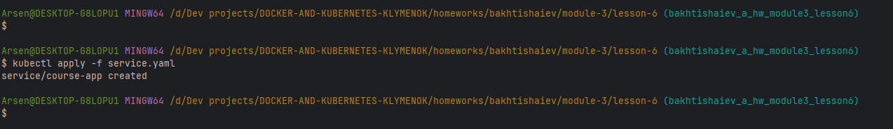
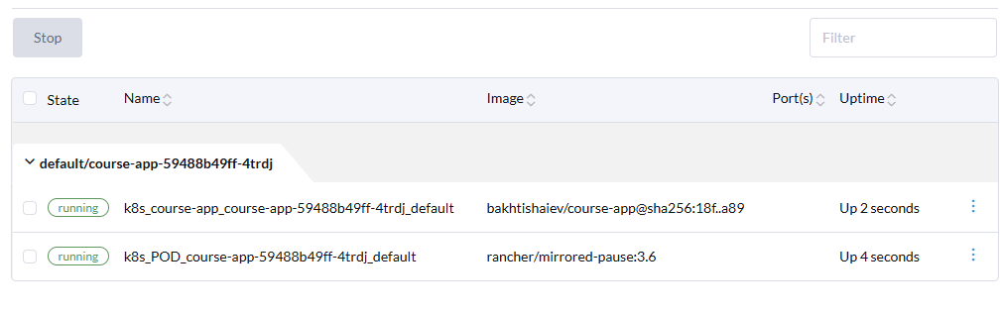
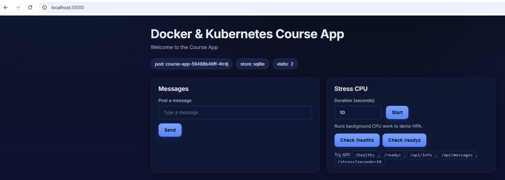
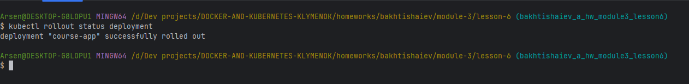
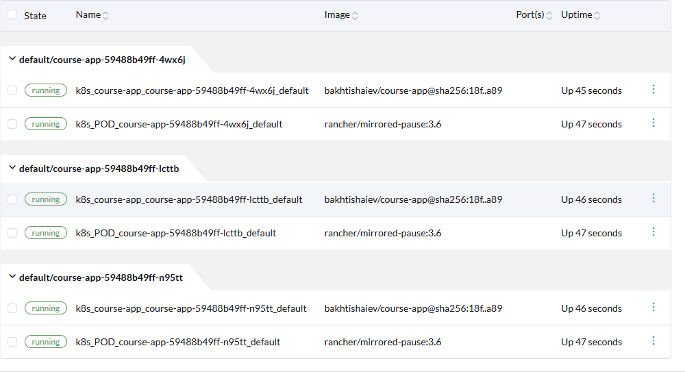

### Розгортання за допомогою Kubernetes

В цілому, створення та розгортання виконано по опису просто з документації.
Проблема виникла один раз з параметром NodePort.
Тут довелося сходити за допомогою до ШІ.
По результатах все завелося:

Після видалення ресурсів, зміни параметра replicas в deployemnt файлі та 
повторного деплоя кількість подів збільшилася відповідно

