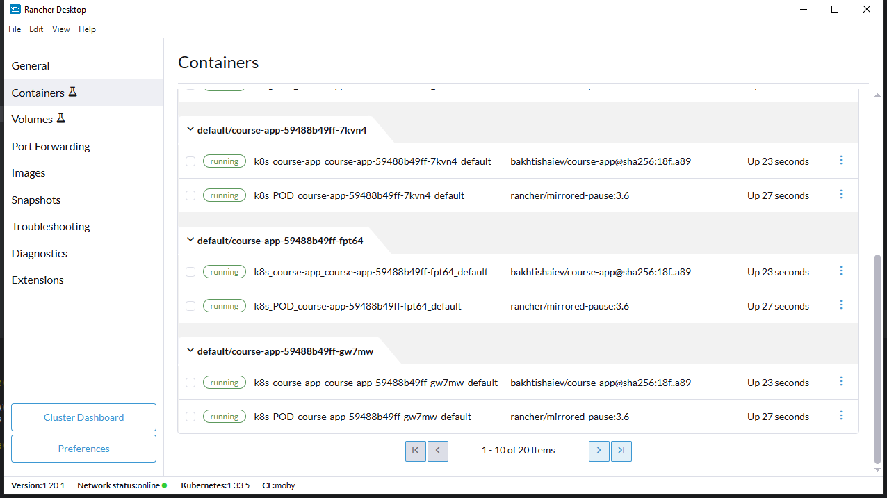
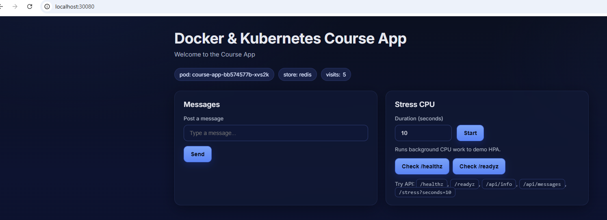
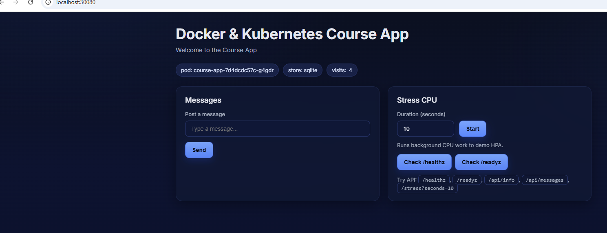

### Масштабування та оркестрація у Kubernetes

Розгортання 10 реплік виконується зміною значення параметра replicas.
Все прозоро та без проблем


Для перевірки ConfigMap доданий файл для розгортання Редіс та доданий відповідний файл
з параметром APP_STORE дорівнюючим "redis"
Додаток запущений, в якості сховища використовується редіс:


В файлі configmap параметр APP_STORE замінений на "sqlite".
Зміни застосовані через 

```
kubectl apply -f configmap.yaml
```

Виконаний роллаут:
```
kubectl rollout restart deployment/course-app
```
В ранчері наблюдаю перестворення подів.
При оновленні сторінки видно, що сховище замінено


В файл deployment.yaml додано:
```
  strategy:
    type: Recreate
```
та перевірено як створюються поди

Як на мене основні нюанси наступні:
Rolling update - немає даунтайму застосунку
Recreate - не треба хвилюватись про зворотню сумісність працюючих версій додатку