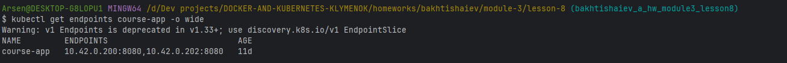

### Service та Ingress у Kubernetes

В цілому, без особливих пригод. Змінюю type на ClusterIp в service.yaml та забираю Nodeport
Ingress файл типовий, додаю readyness-probe в файлі deployments.yaml.
Додаю
```
127.0.0.1   course-app.local
```
в hosts та застовую зміни та ingress файл.
Результат:


## Тест Zero-downtime.
Доданий наступний readinessProbe
```
          readinessProbe:
            exec:
              command:
                - sh
                - -c
                - test -f /tmp/ready
```
Додаток задеплоєний. Всі поди мають статус 0 в Ready
Командою 
```
kubectl exec -it course-app-{uid}  -- sh -c 'touch /tmp/ready'
```
в двох подах створюється файл, та поди отримують 1 в  Ready
Первіряємо адреси:

Командою
```
$ kubectl exec -it course-app-6bc5c7978-w57pw -- sh -c 'rm -f /tmp/ready'
```
З одного з подів видаляємо файл.
Перевіряємо адреси:

Адреса з переліку доступних зникла