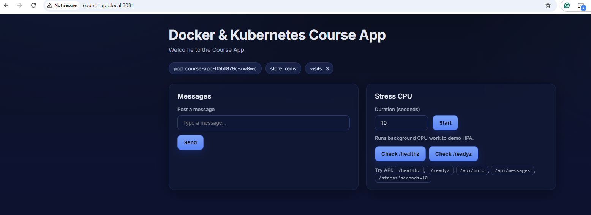

### Автоматизація розгортання за допомогою Helm

Файли helm створені командою 

```
 helm create course-app
```

Після цього файли шаблонів deployment.yaml, service.yaml та values.yaml наповнюємо даними, яки раніше були у відповідних файлах
Встановлюємо redis:

```
$ helm install my-redis bitnami/redis \
  --namespace course-app \
  --set architecture=standalone \
  --set auth.enabled=false

```
І створюємо додатково файл configmap.yaml, щоб задати параметри конфігив
Встановлюємо helm-чарт, перевіряємо - все працює
