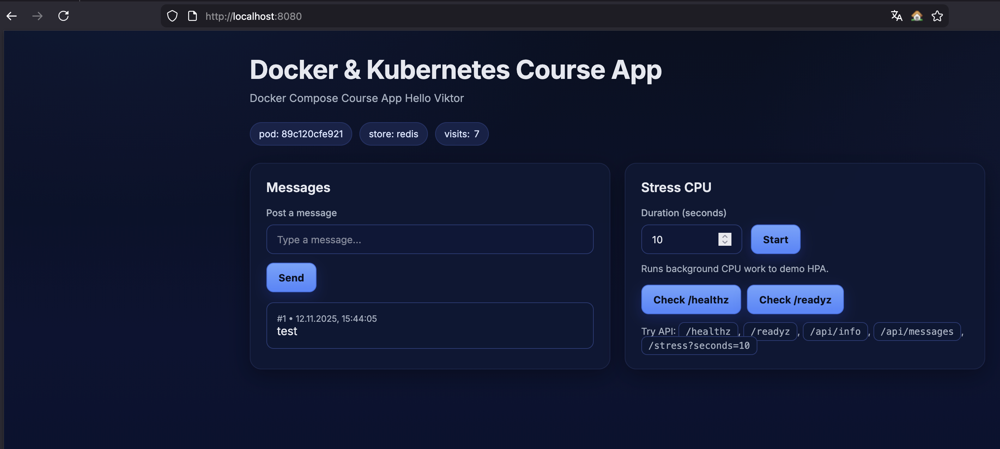

## Запуск

```bash
docker stack deploy -c stack.yml course-app-lesson-05
```

Перевірка
Список стеків
```bash
docker stack ls
```
    NAME                   SERVICES
course-app-lesson-05   2

Сервіси в стеку
```bash
docker stack services course-app-lesson-05
```

|ID          |                    NAME      | MODE        | REPLICAS   | IMAGE                | PORTS         |
|:-------------:|:----------------------------------:| :----------------:| :--------------:| :----------------------:| :-----------------:|
|5eiqqypmacuh | course-app-lesson-05_course_app   | replicated   | 2/2 | viktor1sss/course-app:lesson-04   | *:8080->8080/tcp|
|mazgc70x1ry4 | course-app-lesson-05_redis        | replicated   | 1/1 | redis:7-alpine                    |                 |


Перевіряємо в браузері
Відкриваємо: localhost:8080

