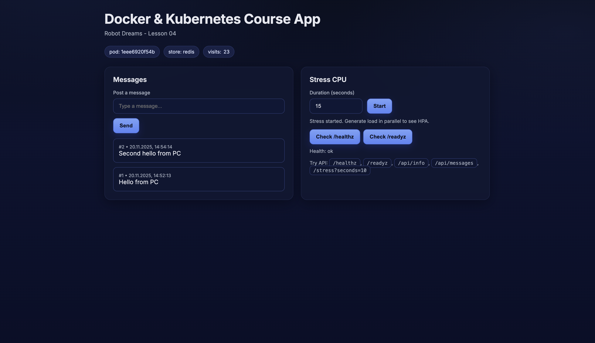

# robot_dreams :: Lessons-04

## Overview



### Перегляд стану

```bash
curl http://localhost:8080/healthz

{"status":"ok"}
```

```bash
curl http://localhost:8080/api/info

{"app":"course-app","hostname":"1eee6920f54b","store":"redis","db_path":"data/data.sql","redis_url":"redis://:qWerty123@redis:6379/0","messages_api":"","counter_api":"","message":"Robot Dreams - Lesson 04","secret_token_present":false,"env":{"APP_STORE":"redis","APP_REDIS_URL":"redis://:qWerty123@redis:6379/0","APP_MESSAGE":"Robot Dreams - Lesson 04"}}
```

```bash
curl http://localhost:8080/api/messages`

{"items":[{"id":2,"text":"Second hello from PC","created_at":"2025-11-20T14:54:14.291926"},{"id":1,"text":"Hello from PC","created_at":"2025-11-20T14:52:13.397054"}]}
```

### Додаткові тести

Штатна робота застосунку (`docker compose stats`)
```
CONTAINER ID   NAME                 CPU %     MEM USAGE / LIMIT     MEM %     NET I/O           BLOCK I/O       PIDS 
1eee6920f54b   lesson-04-python-1   0.28%     48.36MiB / 11.73GiB   0.40%     95.1kB / 275kB    2.19MB / 41kB   6 
1e89a8aef12b   lesson-04-redis-1    0.31%     6.645MiB / 11.73GiB   0.06%     16.6kB / 12.6kB   27.5MB / 0B     6 
```

Активація "стрес-тесту" і результуюче навантаження на CPU (`docker compose stats`)
```
CONTAINER ID   NAME                 CPU %     MEM USAGE / LIMIT     MEM %     NET I/O           BLOCK I/O      PIDS 
1eee6920f54b   lesson-04-python-1   100.21%   46.39MiB / 11.73GiB   0.39%     95.1kB / 275kB    180kB / 41kB   7 
1e89a8aef12b   lesson-04-redis-1    0.06%     6.645MiB / 11.73GiB   0.06%     16.6kB / 12.6kB   27.5MB / 0B    6 
```