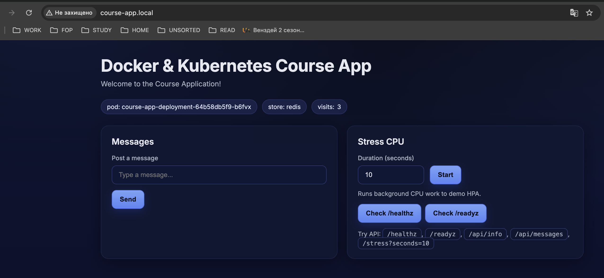

# KUBERNETES

Використав в Deployment:

          envFrom:
            - configMapRef:

Додав 
          livenessProbe:
            httpGet:
              path: /healthz
              port: 8080
              scheme: HTTP
            initialDelaySeconds: 10
            periodSeconds: 10
            timeoutSeconds: 5
            failureThreshold: 3
            successThreshold: 1
          readinessProbe:
            httpGet:
              path: /readyz
              port: 8080
              scheme: HTTP
            initialDelaySeconds: 5
            periodSeconds: 10
            timeoutSeconds: 5
            failureThreshold: 3
            successThreshold: 1

Саме failureThreshold відповідає за те, через скільки проб ПОД перезапуститься

Додав Ingress:
  `class Traefic`

Прописав:
  `/etc/hosts`

вск працює

