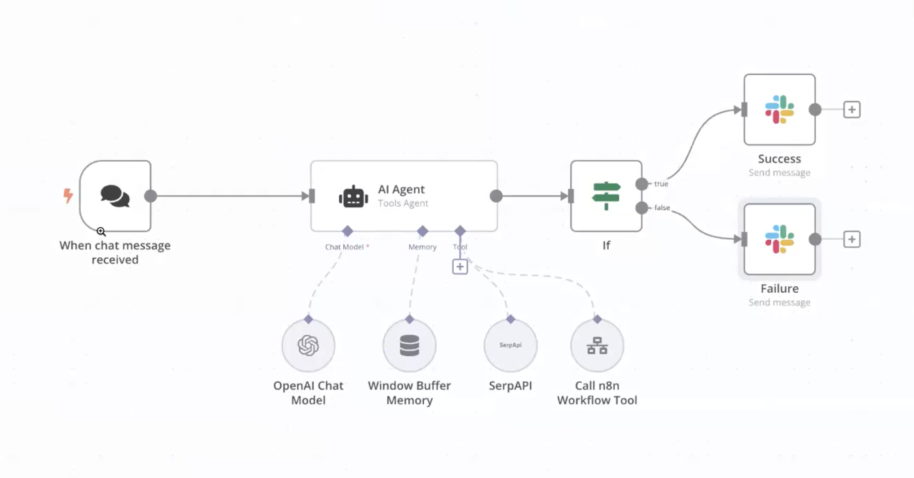
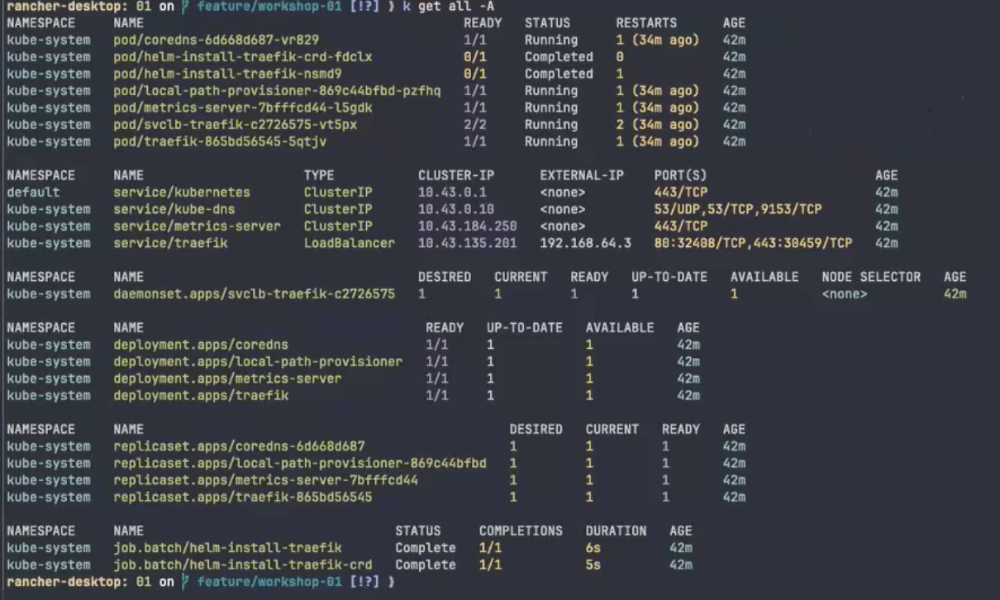
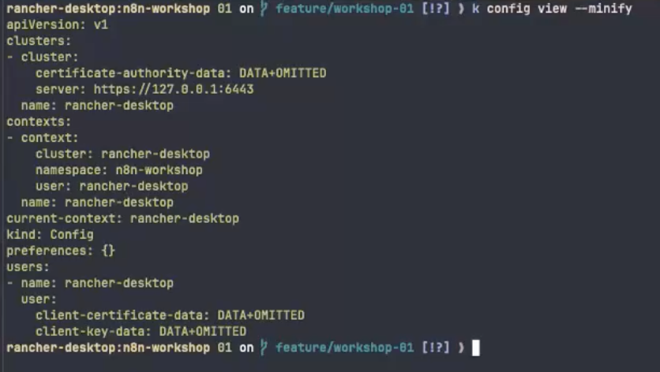

#Nodemation - n8n



`./workshop/01/`

| Файл | Призначення |
| --- | --- |
| `01-namespace-secret.yaml` | Namespace + базовий Secret |
| `02-postgres.yaml` | StatefulSet Postgres + PVC |
| `03-configmap.yaml` | Спільні змінні |
| `04-redis.yaml` | Deployment Redis + Service |
| `05-n8n-main.yaml` | Deployment UI/API + Service |
| `06-ingress.yaml` | Ingress + TLS |
| `07-n8n-worker.yaml` | Deployment воркера |
| `08-resourcequota-limited.yaml` | ResourceQuota (демо) |
| `09-hpa.yaml` | HorizontalPodAutoscaler |
| `10-pdb.yaml` | PodDisruptionBudget |
| `11-stress-job.yaml` | Job навантаження |
| `12-backup-cronjob.yaml` | CronJob бекапу |

## Deployment

0. Check resourse
    `kubectl get all -A`



1. Namespace та базовий Secret

   ```sh
   kubectl apply -f workshop/01/01-namespace-secret.yaml
   kubectl get ns n8n-workshop
   kubectl get secret -n n8n-workshop
   ```
   Використання namespace по замовченню:
   ```
   kubectl config set-context --current --namespace n8n-workshop
   ```

   Далі namespace `n8n-workshop` використовується за замовчуванням, тому `-n` у командах не вказується

    `kubectl config view --minify`



2. Postgres (StatefulSet + PVC)

   ```sh
   kubectl apply -f workshop/01/02-postgres.yaml
   kubectl get pods -l app=postgres -w
   kubectl logs statefulset/postgres --tail=50
   kubectl get pvc
   ```

3. ConfigMap

   ```sh
   kubectl apply -f workshop/01/03-configmap.yaml
   kubectl describe configmap n8n-config
   ```

4. Redis

   ```sh
   kubectl apply -f workshop/01/04-redis.yaml
   kubectl get pods -l app=redis -w
   kubectl logs deploy/redis --tail=30
   ```

5. n8n main (UI/API)

   ```sh
   kubectl apply -f workshop/01/05-n8n-main.yaml
   kubectl get pods -l app=n8n-main -w
   kubectl describe pod -l app=n8n-main
   kubectl logs deploy/n8n-main --tail=50
   ```

6. n8n worker

   ```sh
   kubectl apply -f workshop/01/07-n8n-worker.yaml
   kubectl get pods -l app=n8n-worker -w
   kubectl logs deploy/n8n-worker --tail=30
   ```

7. Ingress (після створення TLS Secret, див. розділ Доступ)

   ```sh
   kubectl apply -f workshop/01/06-ingress.yaml
   kubectl get ingress
   ```

8. Загальна перевірка

   ```sh
   kubectl get all,pvc
   kubectl get events --sort-by='.lastTimestamp'
   ```

   Усі поди мають бути `Running/Completed`, PVC — `Bound`

### 3️⃣ Доступ

1. TLS Secret (якщо ще не створений)

   ```sh
   kubectl create secret tls n8n-tls \
     --cert=workshop/01/n8n.local.crt \
     --key=workshop/01/n8n.local.key
   kubectl get secret n8n-tls
   ```

2. Hostname

   ```sh
   kubectl get ingress n8n -o jsonpath='{.status.loadBalancer.ingress[0].ip}'
   ```

   - Додайте IP адресу у `/etc/hosts` у форматі `IP n8n.local`
Наприклад:
```
192.168.64.3 n8n.local
```

   - Якщо є зовнішній LoadBalancer, використовуйте цей IP або реальний DNS-запис

3. Перевірка HTTPS

   ```sh
    curl -k https://n8n.local/healthz
   ```

   Якщо повертається 200 OK, далі можна відкривати UI

4. Відкриття UI через Ingress в браузері 
5. Альтернатива: port-forward

   ```sh
   kubectl port-forward svc/n8n 5678:5678
   curl http://localhost:5678/healthz
   ```

   Якщо `curl` не повертає 200, перевірити логи `n8n-main` та з’єднання з Postgres/Redis

### 4️⃣ Воркфлоу і воркер

1. У UI створити workflow: Webhook (`/webhook/workshop/demo`) → Code → Respond
2. Активувати workflow
3. В іншому терміналі:

   ```sh
   kubectl logs -l app=n8n-worker -f
   ```

4. Викликати webhook:

   ```sh
   curl -k https://n8n.local/webhook/workshop/demo
   ```

### 5️⃣ ResourceQuota (це деплоїти не обов'язково)

```sh
kubectl apply -f workshop/01/08-resourcequota-limited.yaml
kubectl describe resourcequota rq-limited
kubectl scale deployment/n8n-worker --replicas=3
kubectl get pods
kubectl describe deployment/n8n-worker
kubectl delete resourcequota rq-limited
```

### 6️⃣ HPA + навантаження

Переконайтесь, що `kubectl top nodes` показує метрики перед запуском HPA

```sh
# Вказати власний WEBHOOK_PATH у 11-stress-job.yaml
kubectl apply -f workshop/01/11-stress-job.yaml

watch kubectl get hpa
watch kubectl get pods -l app=n8n-worker
kubectl logs -f job/n8n-stress-job

kubectl delete job n8n-stress-job
```

### 7️⃣ PDB

```sh
kubectl apply -f workshop/01/10-pdb.yaml
kubectl get pdb
kubectl describe pdb n8n-worker-pdb
```

### 8️⃣ CronJob бекапу

```sh
kubectl apply -f workshop/01/12-backup-cronjob.yaml
kubectl get cronjob
kubectl create job --from=cronjob/n8n-db-backup manual-backup
kubectl logs job/manual-backup
kubectl delete job manual-backup
```
