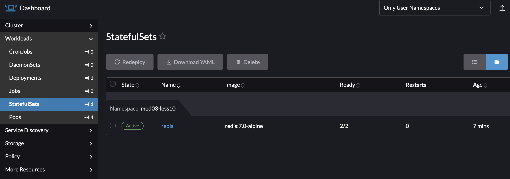
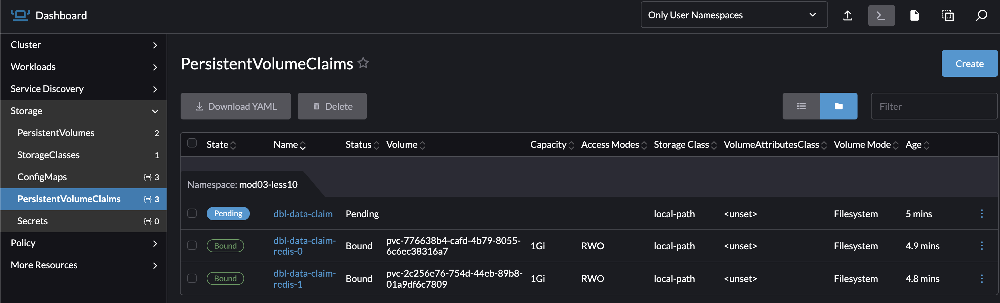

# Завдання

## Аналіз StorageClass

Переконайтеся, що у вашому кластері Rancher Desktop є доступний StorageClass.

Виконайте команду 
    `kubectl get sc`
Ви маєте побачити `local-path` (default). Це означає, що Kubernetes буде створювати фізичні папки на вашому комп'ютері для кожного PVC

## Redis як StatefulSet (Основне завдання)

Вам потрібно створити маніфести для Redis, який буде зберігати дані на диску.

Створіть файл k8s/redis-statefulset.yaml.
Використовуйте kind: StatefulSet.
Образ контейнера: redis:7.0-alpine.
Важливо: Використовуйте секцію volumeClaimTemplates для замовлення диска.

Назва PVC шаблону: redis-data.
Розмір: 1Gi.
AccessMode: ReadWriteOnce.
Підказка: Не вказуйте storageClassName, нехай підтягнеться дефолтний (local-path).
Змонтуйте цей volume у контейнер Redis в папку /data.

## Redis Service

Для доступу до Redis створіть redis-service.yaml.

## Оновлення Deployment course-app

Відредагуйте ваш існуючий deployment.yaml для course-app:

Змініть (або додайте) змінні середовища, щоб додаток почав писати в Redis:
APP_STORE: redis
APP_REDIS_URL: redis://redis:6379
