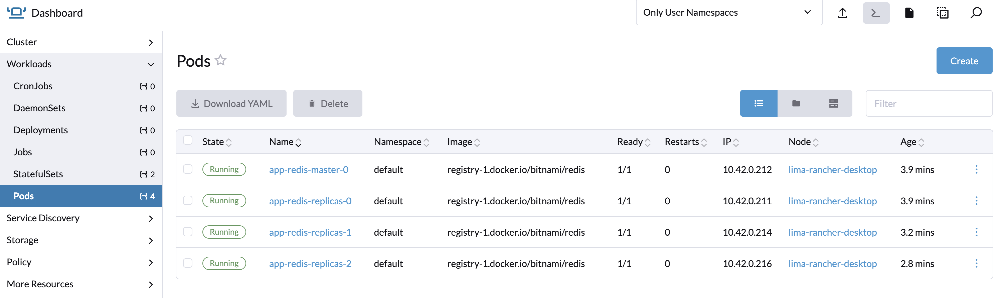
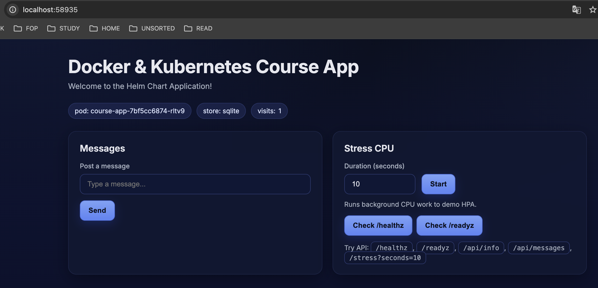

# Helm

## Мета: Перенести створену в попередніх домашніх завданнях інфраструктуру (App + Redis + Ingress) з "сирих" маніфестів (kubectl apply) у керований Helm-чарт

### Створення власного Helm-чарту для course-app

Створіть чарт для вашого застосунку, перенісши логіку з маніфестів попередніх занять (Deployment, Service, Ingress). Вимоги:

`helm create app-chart`

Шаблонізація: Основні параметри мають бути винесені у values.yaml (образ контейнера, тег, кількість реплік, хост Ingress)
Гнучкість: У шаблонах не повинно залишитись хардкоду, який заважав би розгорнути чарт у іншому неймспейсі чи з іншими налаштуваннями.

### Розгортання Redis через Bitnami Redis Chart

Замість написання власного StatefulSet для Redis, розгорніть базу даних, використовуючи популярний ком'юніті-чарт bitnami/redis

### Додайте відповідний репозиторій Helm

```sh
   helm repo add bitnami https://charts.bitnami.com/bitnami
   helm repo update
```

### Встановіть Redis у ваш кластер, налаштувавши необхідні параметри

`helm install app-redis bitnami/redis --namespace mod03-less11 --create-namespace`



Можна задавати параметри оточення, або додавати змінні при інсталяції чарту в файлі values.yaml або задавати індивідуальні змінні через використання прапорця --set.

`--set auth.password="my-strong-password"`

Щоб отримати пароль Redis:

`ECHO export REDIS_PASSWORD=$(kubectl get secret --namespace mod03-less11 app-redis -o jsonpath="{.data.redis-password}" | base64 -d)`

Для доступу до кластеру я підняв клієнта Redis-cli:

`kubectl run --namespace mod03-less11 redis-client --restart='Never'  --env REDIS_PASSWORD=$REDIS_PASSWORD  --image docker.io/bitnami/redis --command -- sleep infinity`

Додав пароль Redis:

`export REDIS_PASSWORD=$(kubectl get secret --namespace mod03-less11 app-redis -o jsonpath="{.data.redis-password}" | base64 --decode)`

## Інтеграція

Оновіть конфігурацію вашого чарту course-app (змінні оточення), щоб застосунок успішно підключався до нового інстансу Redis, розгорнутого через Bitnami

Зa допомогою команди  `helm create app-chart` створив чарт для додатку course-app, потім в файл values.yaml вніс змінні, необхідні для запуску застосунку. Оскільки templates повністю дефолтний, можно всі змінні вказати одразу в values.yaml, а специфічні параметри перекривати dev-values.yaml або prod-values.yaml

Перевірка темплейтів:

`helm template --debug --dry-run course-app`

Запуск чарту:

`helm upgrade --install course-app ./course-app -f ./course-app/values.yaml --namespace mod03-less11`



## PS: Дуже цікава практика!

