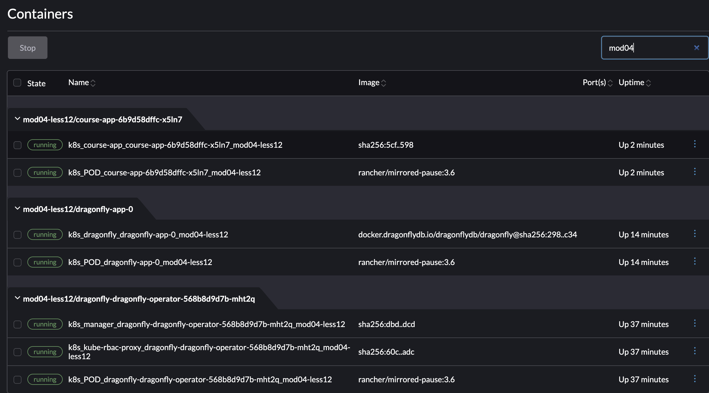
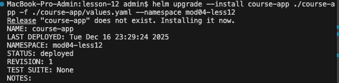
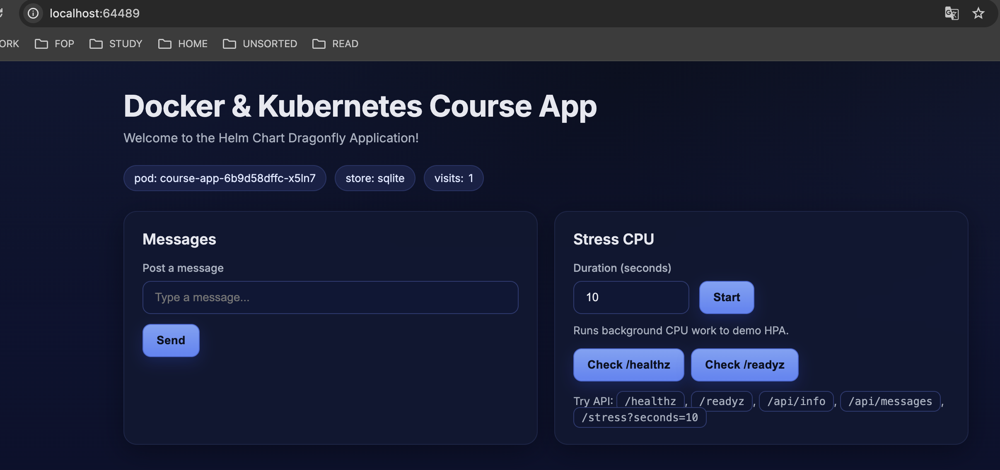
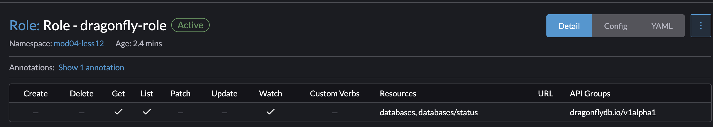
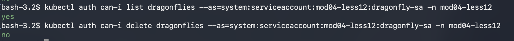

# Dragonfly

## Завдання 1. Dragonfly Operator

Створюю інстанс оператора Dragonfly за допомогою Helm:

`helm upgrade --install dragonfly ./dragonfly-operator -f ./dragonfly-operator/values.yaml --namespace mod04-less12`

Перевіряю:

```bash
bash-3.2$ kubectl api-resources | grep dragonfly
dragonflies    dragonflydb.io/v1alpha1      true         Dragonfly
```



Переглянув FIELDS DESCRIPTION командою:

`kubectl explain dragonfly.spec`

Додав кількість реплік та ресурси.

Створюю Kind: Dragonfly та запускаю

`kubectl apply -f dragonfly.yaml`

Щоб приєднати застосунок до Dragonfly я взяв chart з lesson-11 та змінив environments:

```sh
  APP_MESSAGE: "Welcome to the Helm Chart Dragonfly Application!"
  APP_STORE: "dragonfly-dragonfly-operator"
  APP_REDIS_URL: "dragonfly://dragonfly-operator:6379/0"
```



`helm upgrade --install course-app ./course-app -f ./course-app/values.yaml --namespace mod04-less12`



## Завдання 2. RBAC для Custom Resources

Створіть ServiceAccount, який має право переглядати статус Dragonfly, але не може його видаляти чи змінювати конфігурацію.

ServiceAccount: Створіть SA db-viewer.
Role: Створіть роль db-readonly з правами ["get", "list", "watch"].
Важливо: У полі apiGroups вкажіть групу API Dragonfly (зазвичай це dragonflydb.io), яку ви побачили у виводі api-resources.



Resource: Вкажіть ресурс у множині (наприклад, dragonflies).

Створив все в одному ./db-role/RBAC.yaml

RoleBinding: Зв'яжіть SA db-viewer з роллю db-readonly.

## Завдання 3. Верифікація (auth can-i)

Перевірте коректність RBAC, виконавши команди (підставте правильну назву ресурсу):

 1. Перевірка доступу на читання (Має бути "yes")

`kubectl auth can-i list dragonflies --as=system:serviceaccount:mod04-less12:dragonfly-sa -n mod04-less12`

 2. Перевірка заборони на видалення (Має бути "no")

`kubectl auth can-i delete dragonflies --as=system:serviceaccount:mod04-less12:dragonfly-sa -n mod04-less12`

