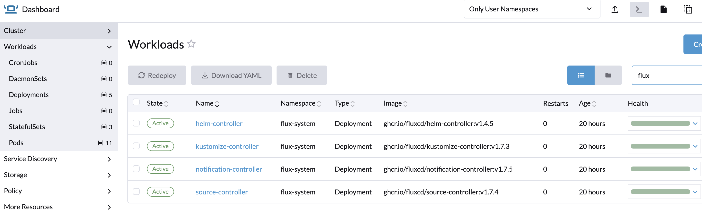
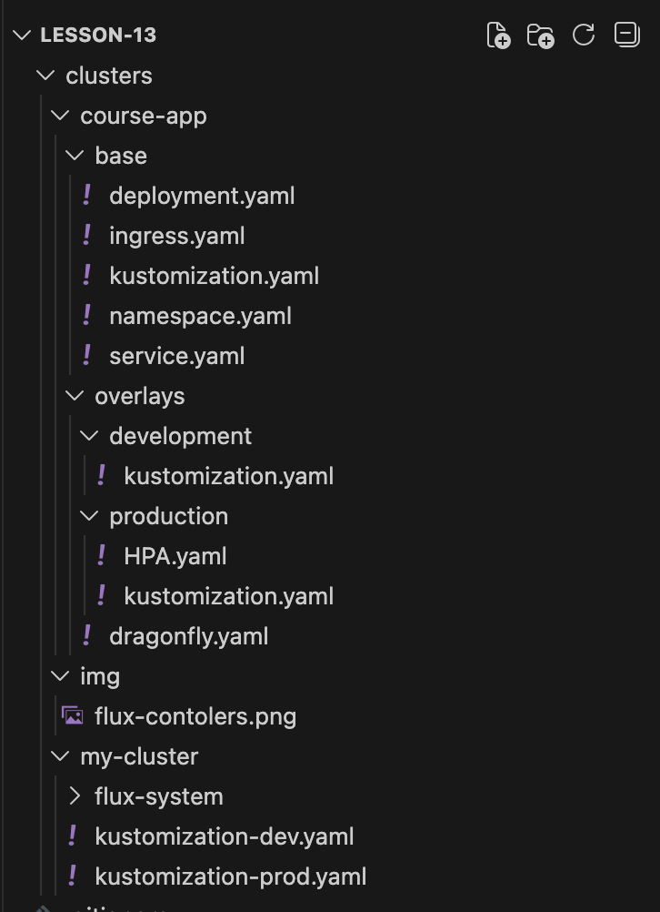
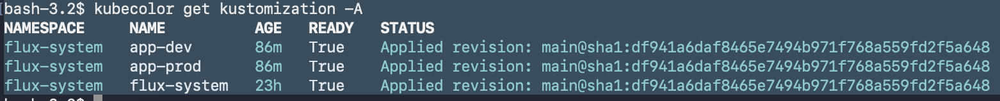
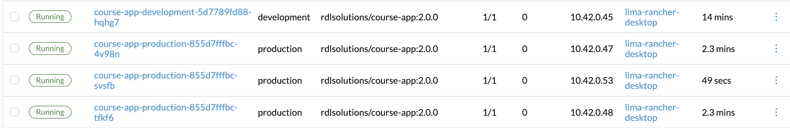
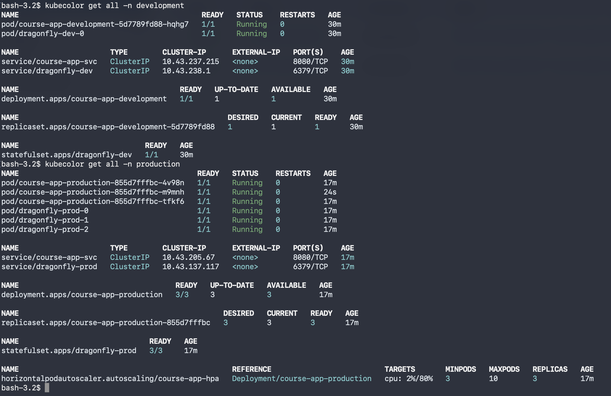

# Домашнє завдання

Мета: Реалізувати повний GitOps-цикл: від створення репозиторію до автоматичного розгортання мульти-середовищного кластера за допомогою Flux CD

## Етап 1: Підготовка інфраструктури

Створіть новий публічний репозиторій на GitHub з назвою rd-fluxcd-lesson. Він має бути пустим (або з README).

### https://github.com/rdlsolutions/rd-fluxcd-lesson/tree/main

Ініціалізуйте Flux CD у вашому локальному кластері (Rancher Desktop), прив'язавши його до цього репозиторію.

Перед виконанням команди нижче - створіть Personal Access Token (PAT) в Github, та виконайте export GITHUB_TOKEN=<ваш_токен>, щоб наступна команда flux bootstrap мала права доступу до репозиторію
flux bootstrap github \

--owner=<ВАШ_GITHUB_USERNAME> \

 --repository=rd-fluxcd-lesson \

 --branch=main \

 --path=./clusters/my-cluster \

 --personal

`flux bootstrap github --owner=rdlsolutions  --repository=rd-fluxcd-lesson  --branch=main  --path=./clusters/my-cluster  --personal`

Після цього кроку у вашому репозиторії автоматично з'явиться папка clusters/my-cluster з системними маніфестами Flux

## Етап 2: Архітектура застосунку (Kustomize Base)

У корені репозиторію створіть структуру папок для деплою з Kustomize (base та overlays). У папці base опишіть стандартні маніфести для нашого веб-застосунку — course-app:

Deployment
Service (ClusterIP)
Ingress (налаштований на course-app.local або localhost)
kustomization.yaml, що об'єднує їх.

## Етап 3: Середовище Development (Overlay)

Створіть оверлей для development.

Вимоги:

Окремий Namespace: development.
Кількість реплік застосунку: 1.
База даних Dragonfly:
Ми використовуємо підхід з попереднього заняття (Operator Pattern).
У папці оверлея створіть файл dragonfly.yaml, де опишіть інстанс БД через kind: Dragonfly.
(Важливо) Вважаємо, що Dragonfly Operator вже встановлений у кластері вручну з минулого уроку. Можна також встановити через Flux (опціональне завдання нижче)
Опціонально: Якщо хочете "чистий" GitOps, налаштуйте встановлення самого Dragonfly Operator через Flux. Для цього в окремій папці (наприклад infrastructure/controllers/dragonfly) створіть HelmRepository (джерело чарту оператора) та HelmRelease (інсталяція оператора).

## Етап 4: Середовище Production (Overlay)

Створіть оверлей для production.

Вимоги:

Окремий Namespace: production.
Кількість реплік застосунку: 3
Кількість реплік Dragonfly: 2
Resources & Autoscaling:
Додайте Requests/Limits для CPU та Memory у Deployment.
Описав HorizontalPodAutoscaler (HPA), який масштабує под від 3 до 10 копій в HPA.yaml.

## Етап 5: "Вмикаємо" GitOps

На даному етапі у вас просто лежать файли в репозиторії. Flux про них ще не знає (він знає тільки про системну папку clusters/my-cluster).

Завдання: Створіть маніфести, які "скажуть" Flux-у слідкувати за вашими папками overlays/development та overlays/production.

Підказка: Вам потрібно створити два об'єкти типу Kustomization (API kustomize.toolkit.fluxcd.io/v1). Ці маніфести найкраще покласти у папку clusters/my-cluster у вашому git-репозиторії — тоді Flux підхопить їх автоматично, бо він вже слухає цю папку.

Перевірка (Definition of Done)
У GitHub репозиторії rd-fluxcd-lesson є структура base, overlays та clusters.
Команда flux get kustomizations показує три об'єкти в статусі Ready: flux-system (системний), app-dev та app-prod (ваші).
У кластері існують неймспейси development та production.
В development запущено 1 под застосунку + піднявся інстанс Dragonfly (через оператор).
В production запущено 3 поди застосунку, Dragonfly кластер з 2-х реплік + працює HPA
Drift Check: Якщо видалити сервіс у production руками (kubectl delete svc ...), Flux має відновити його протягом хвилини.

## Формат здачі: Посилання на ваш публічний репозиторій rd-fluxcd-lesson

Скриншоти, де видно що:

### ресурс Kustomization та GitRepository в статусі Ready

### в неймспейсі development та production відрізняється кількість подів

### в production є додаткові ресурси, які були описані в overlay

